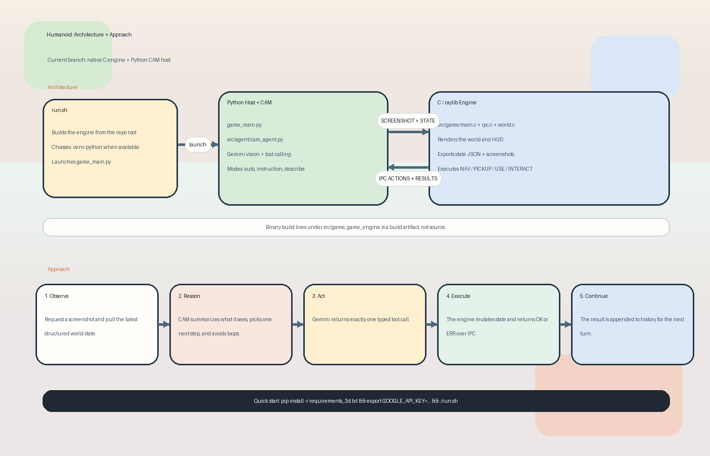

# Humanoid

Humanoid is a 3D embodied AI harness. A Python host runs CAM, a Gemini-powered agent, while a native C/raylib game engine renders the world, exposes state over IPC, and executes the agent's actions.



## Demo

[Demo video](https://streamable.com/3z7joc)

## What It Does

CAM lives in a small stone courtyard puzzle:

- find the brass key
- unlock the central gate
- reach the treasure chest
- optionally collect crystals, pull the lever, and read the signpost

The harness loop is:

1. Capture a fresh screenshot from the engine.
2. Read structured game state over IPC.
3. Ask Gemini for exactly one tool call.
4. Execute that action in the C engine.
5. Feed the result back into CAM's running history.

## Quick Start

```bash
python3 -m venv .venv
source .venv/bin/activate
pip install -r requirements_3d.txt

cat > .env <<'EOF'
GOOGLE_API_KEY=your-key-here
EOF

./run.sh
```

`run.sh` builds `src/game/game_engine` and then launches `game_main.py` from the repo root.
If a repo-root `.env` file exists, both `run.sh` and `game_main.py` load it automatically.

## Controls

- `TAB` toggles auto/manual mode
- `ENTER` submits typed input to CAM
- `F1` asks CAM to describe the scene without moving
- `ESC` clears the input box

## Project Layout

- [run.sh](run.sh): root launcher
- [game_main.py](game_main.py): Python host, IPC bridge, event loop
- [src/agent/cam_agent.py](src/agent/cam_agent.py): CAM prompt, modes, tool-calling
- [src/game/main.c](src/game/main.c): native render loop
- [src/game/ipc.c](src/game/ipc.c): line-based Python/C protocol
- [src/game/world.c](src/game/world.c): world geometry and objects
- [src/game/hud.c](src/game/hud.c): native HUD and input overlay

## Build And Run On Other Machines

This branch is no longer the old 2D Python demo. It is a native C/raylib game plus a Python Gemini host.

You need:

- Python 3
- `pip install -r requirements_3d.txt`
- a repo-root `.env` with `GOOGLE_API_KEY=...`, or an exported `GOOGLE_API_KEY`
- a C compiler
- `make`
- `pkg-config`
- `raylib`

### macOS

```bash
brew install raylib pkg-config python

python3 -m venv .venv
source .venv/bin/activate
pip install -r requirements_3d.txt

cat > .env <<'EOF'
GOOGLE_API_KEY=your-key-here
EOF

./run.sh
```

### Linux

Ubuntu/Debian example:

```bash
sudo apt update
sudo apt install -y build-essential pkg-config libraylib-dev python3 python3-venv

python3 -m venv .venv
source .venv/bin/activate
pip install -r requirements_3d.txt

cat > .env <<'EOF'
GOOGLE_API_KEY=your-key-here
EOF

./run.sh
```

If your distro does not package `libraylib-dev`, install raylib another way and make sure `pkg-config --cflags raylib` works before running `./run.sh`.

### Windows

Use the `MSYS2 UCRT64` shell. The engine currently expects a Unix-style toolchain and POSIX APIs.

```bash
pacman -S --needed \
  mingw-w64-ucrt-x86_64-toolchain \
  mingw-w64-ucrt-x86_64-raylib \
  mingw-w64-ucrt-x86_64-pkgconf \
  mingw-w64-ucrt-x86_64-python \
  mingw-w64-ucrt-x86_64-python-pip

python -m venv .venv
source .venv/bin/activate
pip install -r requirements_3d.txt

cat > .env <<'EOF'
GOOGLE_API_KEY=your-key-here
EOF

bash ./run.sh
```

Notes:

- Build and run from the same `MSYS2 UCRT64` shell.
- `pkg-config --cflags raylib` should return flags before the build starts.
- The engine is the current shipped path on this branch.
# humanoid
